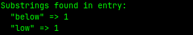

# substrings
An implementation of a method that takes a string and an array of valid substrings (a "dictionary") as arguments and returns a tally of each substring that was found in the original string.

### Check it out yourself

If you've got Ruby installed on your local machine, you can either

- Copy the contents of the script, `substrings.rb`, and paste it into the Interactive Ruby Shell (IRB) from the command line.

OR

- Run the script, using
    ```
    ruby substrings.rb
    ```
    from your command line.

Otherwise, you can just paste the contents into any Ruby REPL online.

### Screenshot

Here's a usage example where the `#substrings` method was called with:

```ruby
dictionary = ["below","down","go","going","horn","how","howdy","it","i","low","own","part","partner","sit"]
word = "below"

substrings(word, dictionary)
```

